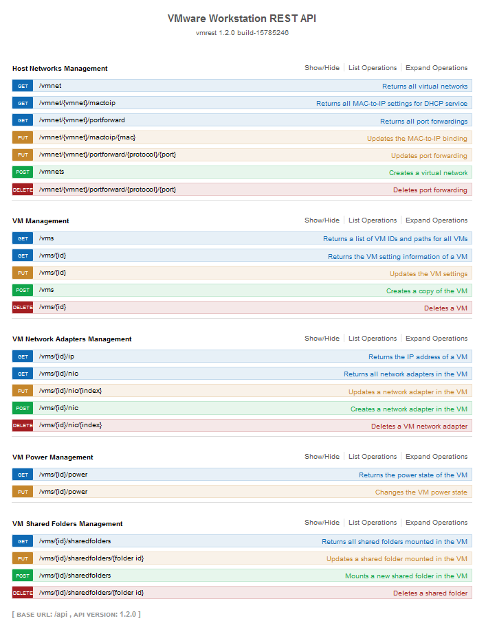

# Ansible-VMware-Workstation-Modules

## Actual state of the modules: 12/23
VMware Workstation's REST API is designed as follow:
- 23 possibles requests
- Divided into 5 categories

First goal of the project is to implement all the requests. For the time being, following VMware's logic. Next goal may be to concatenate some of the requests to create better categories.

### Host Networks Management: 5/7

**vmware_workstation_vminfos**

Implemented:
- Returns all virtual networks
- Returns all MAC-to-IP settings for DHCP service
- Returns all port forwardings

Implemented but not working yet because of administratives rights problem:
- Creates a virtual network
- Deletes port forwarding

Not implementing until admin rights problems fixed:
- Updates the MAC-to-IP binding
- Updates port forwarding

### VM Management: 5/5
Complete! :tada: This section is implemented as follow:

**vmware_workstation_vminfos**
- Returns a list of VM IDs and paths for all VMs
- Returns the VM setting information of a VM

**vmware_workstation_vmmgt**
- Updates a VM CPU/RAM allocation
- Clone a VM 
- Deletes a VM

### VM Network Adapters Management: 0/5

Not implemented yet:

- Returns all network adapters in the VM
- Returns the IP address of a VM
- Updates a network adapter in the VM
- Creates a network adapter in the VM
- Deletes a VM network adapter

### VM Power Management: 2/2
Complete! :tada: This section is implemented as follow:

**vmware_workstation_power**.
- Returns the power state of the VM
- Changes the VM power state

### VM Shared Folders Management: 0/4

Not implemented yet:

- Returns all shared folders mounted in the VM
- Updates a shared folder mounted in the VM
- Mounts a new shared folder in the VM
- Deletes a shared folder